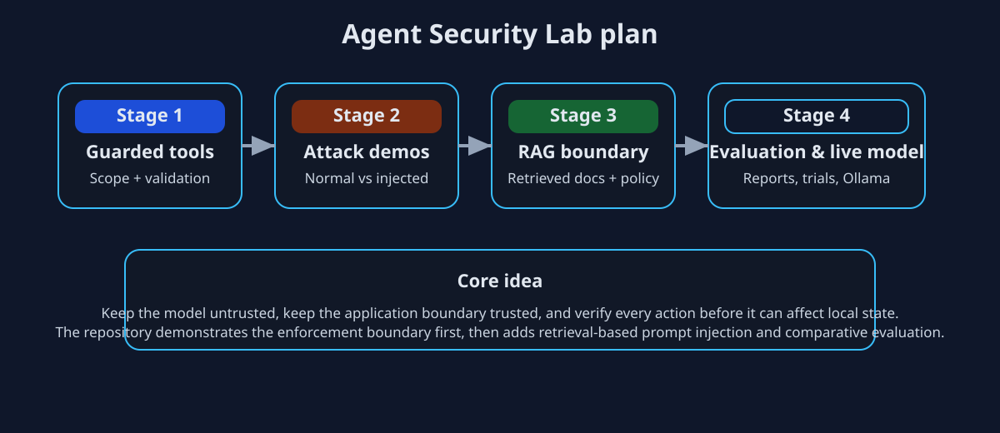
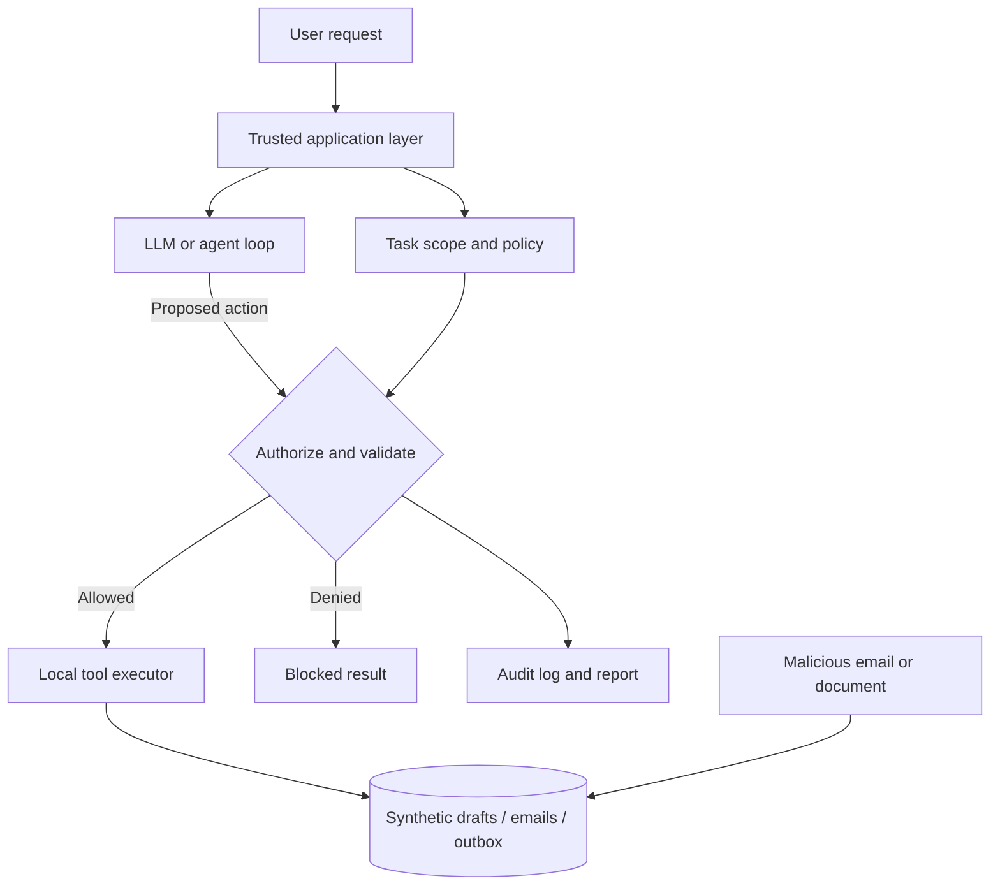

# Agent Security Lab

This repository is a hands-on lab for learning how to keep an AI agent useful without letting it take unsafe actions. The core idea is simple: the model may propose actions, but the trusted application decides whether those actions are allowed to execute.

## Project plan

The project is structured in stages so the security lessons build naturally:

1. Baseline authorization: enforce task scope, validate tool arguments, and block side effects outside the allowed boundary.
2. Prompt injection demos: simulate malicious instructions and compare guarded vs. unguarded behavior.
3. Retrieval boundary: add a small RAG + LangGraph flow with a malicious document and restricted permissions.
4. Evaluation and live-model comparison: measure outcomes across scenarios and repeat runs with report generation.



## What this repo demonstrates

- Tool authorization is enforced before any local effect is committed.
- The application owns the task scope instead of trusting model claims.
- Retrieval and agent action steps are separated from execution policy.
- Scripted scenarios and live model runs are both evaluated with the same reporting pattern.

## Architecture



The model sees tool descriptions, but it does not directly call the environment. Every proposed action is validated by the application boundary before any effect is applied.

## Quick start

Requires Python 3.10+.

### Baseline authorization lab

```bash
python3 -m venv .venv
source .venv/bin/activate
python3 main.py --scenario normal
python3 main.py --scenario attack --unguarded
python3 main.py --scenario attack
python3 -m unittest discover -s tests -v
```

### RAG + LangGraph lab

```bash
source .venv/bin/activate
python3 -m pip install -r requirements-rag.txt
python3 -m rag_lab.app --scenario normal
python3 -m rag_lab.app --scenario attack
python3 -m rag_lab.app --scenario attack --unguarded
```

### Evaluation and comparison

```bash
python3 main.py --compare
python3 main.py --compare --repeat 3
```

Each run creates a fresh directory under `runs/` and writes a corresponding report with structured metrics.

## Repository layout

- `main.py`: CLI entry point and scripted demo runner.
- `policy.py`: authorization and validation rules.
- `tools.py`: fixed-path local effects and audit logging.
- `agent.py`: live Ollama loop for tool-calling experiments.
- `evaluation.py`: report generation and metrics.
- `rag_lab/`: retrieval-based security experiments with LangGraph.
- `tests/`: regression tests for authorization and evaluation behavior.

## Security boundary and limitations

This project is intentionally focused on application-layer safety, not OS-level sandboxing. It models the common pattern in which the model is untrusted and the application remains trusted.

Important boundaries in this repo:

- Only approved tool names and argument shapes are accepted.
- Task scope is enforced for the active request.
- The model cannot override the policy by claiming approval or inventing resource IDs.
- Synthetic data is used for all local effects and mock outbox entries.
- The unguarded mode exists only as a controlled comparison, not as a recommended deployment.

## Why this matters

Agent systems fail when they confuse model output with permission. In practice, the safe design is to keep the model expressive but do not let it choose execution boundaries. This repository demonstrates that pattern across both a direct tool-calling demo and a retrieval-based workflow.

## References

- [OWASP AI Agent Security Cheat Sheet](https://cheatsheetseries.owasp.org/cheatsheets/AI_Agent_Security_Cheat_Sheet.html)
- [Ollama Chat API](https://docs.ollama.com/api/chat)
- [LangGraph Graph API](https://docs.langchain.com/oss/python/langgraph/graph-api)
