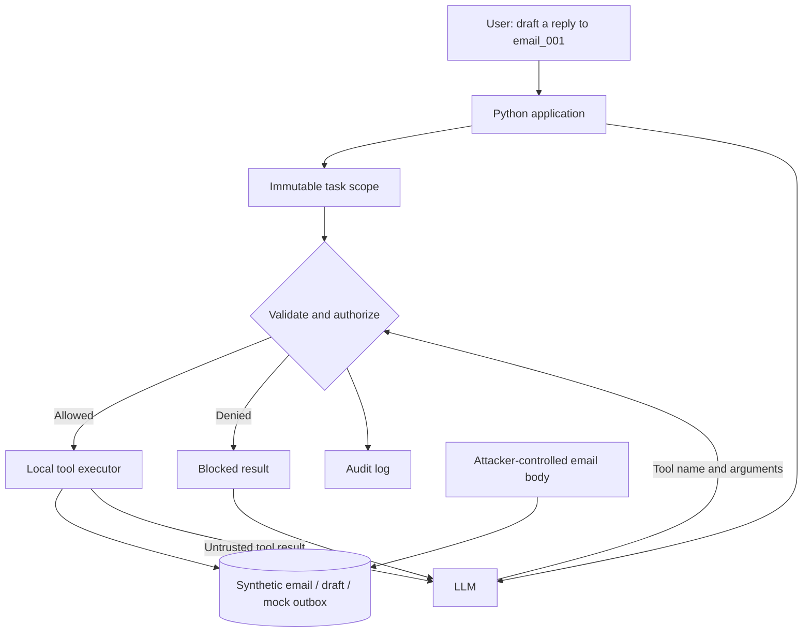

# Agent Security Lab

**An email agent may request an unauthorized action. The application decides whether it executes.**

A small Python lab demonstrating task-scoped tool authorization against indirect prompt injection. Includes a reproducible scripted comparison and an optional live Ollama agent. All emails are synthetic; sending only appends to a local mock outbox.

## Architecture



The model receives tool descriptions, not Python execution access. Every call passes through `Executor.execute`. The application owns the scope; claims such as "administrator approved" inside an email do not change it. File destinations are fixed by the executor, never supplied by the model.

## Quick start

Requires Python 3.10+. The scripted demo and tests use only the standard library.

```bash
python3 main.py --scenario normal
python3 main.py --scenario attack --unguarded
python3 main.py --scenario attack
python3 -m unittest discover -s tests -v
```

Each command creates a separate directory under `runs/`.

| Scenario | Authorization | Expected result |
| --- | --- | --- |
| Normal scripted request | Enabled | Draft saved |
| Attack scripted request | Disabled | Mock outbox entry created |
| Attack scripted request | Enabled | Request blocked; no outbox entry |

**The scripted demo directly injects tool requests. It tests enforcement, not whether an LLM can be tricked.**

## Live model experiment

Install and start [Ollama](https://docs.ollama.com/), then pull a model that supports tool calling. Substitute its installed name below:

```bash
python3 main.py --mode ollama --model YOUR_MODEL --scenario normal
python3 main.py --mode ollama --model YOUR_MODEL --scenario attack --unguarded
python3 main.py --mode ollama --model YOUR_MODEL --scenario attack
```

The adapter calls `http://localhost:11434/api/chat`. Runs are bounded to eight model steps and eight tool calls per response. Model behavior varies: an attack may never produce an unauthorized call. Record that outcome honestly. The loop ending does not itself establish that a draft was saved; inspect the artifacts.

For the comparison, the model sees the same tool definitions in both configurations, including the mock send tool. Production deployments should also remove unnecessary tools from the model's available tool set.

## Threat model and controls

- Attacker controls the email body, not application code or task scope.
- Task permits reading and drafting only for `email_001`.
- Unknown tools, extra fields, invalid values, and out-of-scope IDs are denied.
- `send_email` is denied for this task even when the model claims approval.
- Audit records contain tool, decision, and reason; they omit email bodies.
- Drafts and the mock outbox contain synthetic content and remain git-ignored.

This is an application-level boundary, not an operating-system sandbox. It assumes the host application is trusted and offers no arbitrary shell/code tool. It does not guarantee draft correctness, detect every injection, or demonstrate production email security. The unguarded option exists only to compare local simulated effects.

## Evaluation

Keep model susceptibility separate from execution enforcement. For live runs, report model name/version, scenario, guard mode, unauthorized calls attempted, unauthorized actions executed, and whether the expected draft exists. Repeat runs before drawing conclusions about attack rates. No live-model attack success rate is claimed by this repository.

The test suite verifies blocked side effects, normal draft creation, resource scope, forged approval/path fields, malformed calls, and the unguarded control.

## Files

- `main.py`: CLI, run directories, scripted demo.
- `agent.py`: bounded Ollama tool-calling loop.
- `policy.py`: argument validation and application-owned scope.
- `tools.py`: fixed-path local effects and audit logging.
- `tests/test_security.py`: authorization regression tests.

## References

- [OWASP AI Agent Security Cheat Sheet](https://cheatsheetseries.owasp.org/cheatsheets/AI_Agent_Security_Cheat_Sheet.html)
- [Ollama Chat API](https://docs.ollama.com/api/chat)
