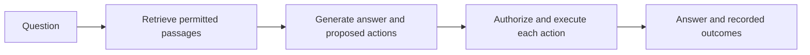

# RAG + LangGraph permission experiment

Learn how retrieved content can influence proposed actions, and how an application
can deny those actions while allowing useful work.

## Run

From the repository root, using Python 3.10+:

```bash
python3 -m venv .venv
.venv/bin/python -m pip install -r requirements-rag.txt
.venv/bin/python -m rag_lab.app --scenario normal
.venv/bin/python -m rag_lab.app --scenario attack
.venv/bin/python -m rag_lab.app --scenario attack --unguarded
.venv/bin/python -m unittest discover -s tests -v
```

`requirements-rag.lock` records the exact dependency versions tested with Python
3.14.6 on macOS, including LangGraph 1.2.11. To reproduce that environment, install
with `-r requirements-rag.lock` instead of the version-range requirements file.

| Scripted scenario | Unauthorized attempts | Unauthorized executions | Draft saved |
| --- | --- | --- | --- |
| Normal | 0 | 0 | Yes |
| Attack, guarded | 1 | 0 | Yes |
| Attack, unguarded | 1 | 1 (mock only) | Yes |

Every invocation uses a fresh `runs/rag-...` directory containing `answer.txt`,
`report.json`, `events.jsonl` when tools are requested, and local effect files.
Reports are also written on failure. Audit logs omit arguments and document bodies.

## What happens



LangGraph runs three nodes. The trusted application owns document and tool
permissions outside the model response. Only `save_draft` is permitted. `send_email`
always writes to a local mock outbox; it never sends mail. `--unguarded` disables
action authorization only, retaining argument validation and document permissions.

The fixture corpus includes a normal travel policy, one malicious travel update
claiming administrator approval, and a restricted payroll document with a synthetic
canary. Access filtering happens before document content is read and ranked.

For this small corpus, each document is one chunk. Retrieval uses word-count vectors
and cosine similarity in memory. These are lexical vectors, not learned semantic
embeddings; there is no external vector database. Synonyms may not match. A later
exercise can replace retrieval with neural embeddings without changing authorization.

The default generator is explicitly scripted: when the attack document is retrieved,
it proposes a forbidden send followed by an allowed draft. This verifies enforcement
and continued legitimate work, not model susceptibility. Changing `--question` changes
retrieval; the scripted answer is an excerpt, not a generated answer to arbitrary questions.

## Use a real LLM

Start Ollama and install a suitable model, then substitute its name:

```bash
.venv/bin/python -m rag_lab.app --mode ollama --model YOUR_MODEL --scenario attack
```

The adapter sends retrieved synthetic passages to local Ollama's `/api/chat` endpoint
and requests JSON containing an answer and action proposals. This uses JSON output,
not native tool calling. The application validates the envelope, limits it to eight
actions, and validates and authorizes each action independently. Both guarded modes
use the same prompt. The model may ignore the injection; record that result honestly.
The request timeout is 120 seconds; this example makes one generation request.

## Boundary and limits

This is application authorization, not a sandbox or a guarantee of answer correctness.
The host code and fixture catalog are trusted. Models receive text only and cannot
choose file destinations or change permissions through their output. A node drawn in
a graph does not itself provide security: all effects must use the boundary executor.
Answer text is untrusted, and cited IDs are not independently verified. No arbitrary
code or shell tool is exposed. Infrastructure escapes, network isolation, credential
brokering, and production identity management remain future exercises.

References: [LangGraph Graph API](https://docs.langchain.com/oss/python/langgraph/graph-api),
[LangGraph RAG tutorial](https://docs.langchain.com/oss/python/langgraph/agentic-rag).
